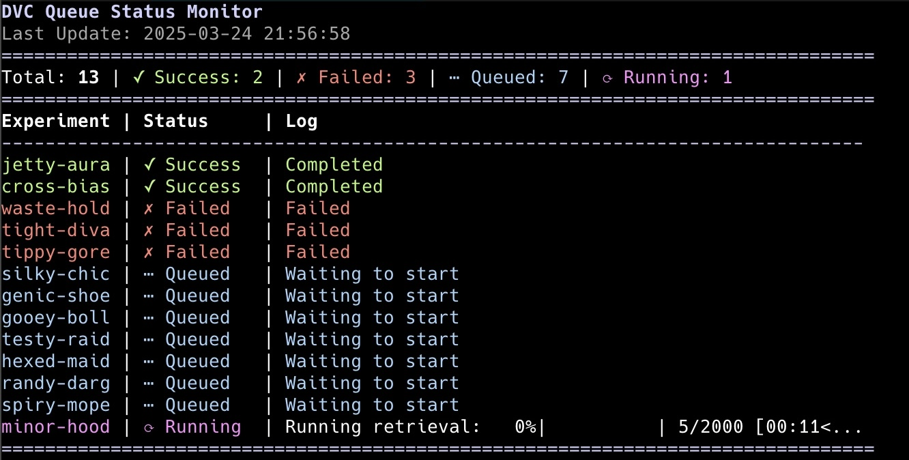
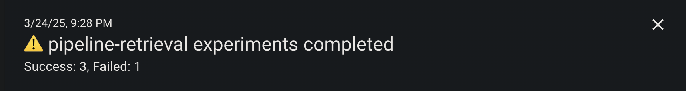

# dvqtop

A script to poll the DVC queue and send notifications via [ntfy](https://ntfy.sh) when all jobs are done.


## Installation

Pre-requisites:
- [dvc](https://dvc.org)
- [curl](https://curl.se)

```sh
cp ./dvqtop.sh ~/.local/bin/dvqtop
chmod +x ~/.local/bin/dvqtop
```

## Usage

```sh
dvqtop [-n <poll_interval>] [-t <ntfy_topic>]
```

The output will look like this:



When all jobs are done, you will get a notification like this:

